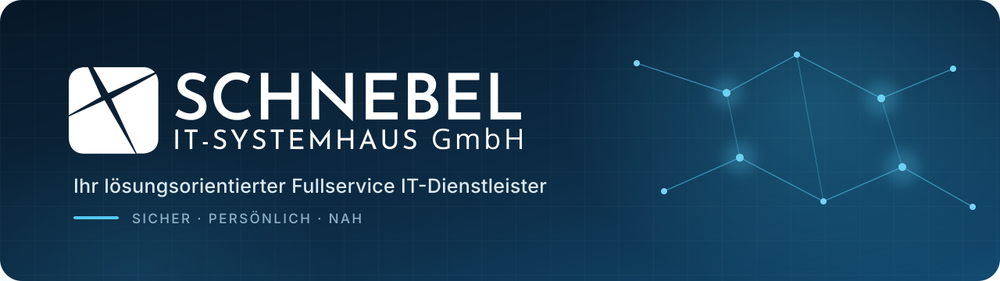

<!--
  GitHub Organization Profile
  Ablageort: .github/profile/README.md
-->

  

 

  
  
  

IT, die Unternehmen voranbringt

Willkommen bei der GitHub-Organisation der Schnebel IT-Systemhaus GmbH.

Wir planen, realisieren und betreuen individuell zugeschnittene IT-Gesamtlösungen für Unternehmen. Von der ersten Analyse bis zum laufenden Betrieb verbinden wir moderne Technologien mit persönlicher Beratung, zuverlässigem Support und einem klaren Blick für Sicherheit.

Hier bündeln wir ausgewählte Projekte, Tools und technische Ressourcen aus unserem Arbeitsalltag.

Unsere Leistungen

<table>
  <tr>
    <td width="50%" valign="top">
      <h3>🧭 Consulting & Digitalisierung</h3>
      
IT-Landschaften analysieren, Prozesse optimieren und digitale Workflows sinnvoll weiterentwickeln.

      <a href="https://www.schnebel-it.de/leistungen/consulting-digitalisierung/">Mehr erfahren →</a>
    </td>
    <td width="50%" valign="top">
      <h3>📡 Support & Monitoring</h3>
      
Proaktive Überwachung, Patch Management und schnelle Unterstützung durch einen eigenen Helpdesk.

      <a href="https://www.schnebel-it.de/leistungen/support-monitoring/">Mehr erfahren →</a>
    </td>
  </tr>
  <tr>
    <td width="50%" valign="top">
      <h3>🛡️ IT-Security</h3>
      
Schutz für Netzwerke, Systeme und Daten, abgestimmt auf die Anforderungen moderner Unternehmen.

      <a href="https://www.schnebel-it.de/leistungen/security/">Mehr erfahren →</a>
    </td>
    <td width="50%" valign="top">
      <h3>☁️ Cloud & Backup</h3>
      
Flexible Cloud-Lösungen und belastbare Backup-Konzepte für Verfügbarkeit und Kontinuität.

      <a href="https://www.schnebel-it.de/leistungen/cloud-loesungen/">Cloud-Lösungen →</a>
      ·
      <a href="https://www.schnebel-it.de/leistungen/backup-loesungen/">Backup-Lösungen →</a>
    </td>
  </tr>
  <tr>
    <td width="50%" valign="top">
      <h3>☎️ Moderne Telefonie</h3>
      
Zukunftsfähige Kommunikationslösungen für vernetzte Teams und zuverlässige Erreichbarkeit.

      <a href="https://www.schnebel-it.de/leistungen/telefonie-loesungen/">Mehr erfahren →</a>
    </td>
    <td width="50%" valign="top">
      <h3>🏡 Sicheres Homeoffice</h3>
      
Professionelle Arbeitsplätze, sichere Zugänge und passende Lösungen für mobiles Arbeiten.

      <a href="https://www.schnebel-it.de/leistungen/homeoffice-loesungen/">Mehr erfahren →</a>
    </td>
  </tr>
</table>
 

<h2>Wofür wir stehen</h2>

<table align="center">
  <tr>
    <td align="center" width="33%">
      <strong>Alles aus einer Hand</strong> 
      Planung, Umsetzung und Wartung
    </td>
    <td align="center" width="33%">
      <strong>Proaktiv statt reaktiv</strong> 
      Monitoring und frühzeitige Fehlererkennung
    </td>
    <td align="center" width="33%">
      <strong>Service nach Maß</strong> 
      Individuelle Lösungen statt Standardschablonen
    </td>
  </tr>
</table>
 

Sicherheit und Support

Bitte veröffentliche in Issues, Discussions oder Pull Requests keine Zugangsdaten, Kundendaten oder vertraulichen Systeminformationen.

Für technische Unterstützung und sicherheitsrelevante Hinweise nutze bitte unsere offiziellen Kontaktwege:

  
  

Komm ins Team

Du möchtest moderne IT nicht nur benutzen, sondern mitgestalten? Entdecke unsere aktuellen Stellen, Ausbildungsangebote und Möglichkeiten für eine Initiativbewerbung.

  

 

  <strong>Schnebel IT-Systemhaus GmbH</strong> 
  Keramikstraße 8 · 77736 Zell am Harmersbach · <a href="mailto:info@schnebel-it.de">info@schnebel-it.de</a>
    
  Individuell. Kompetent. Persönlich. Nah.

